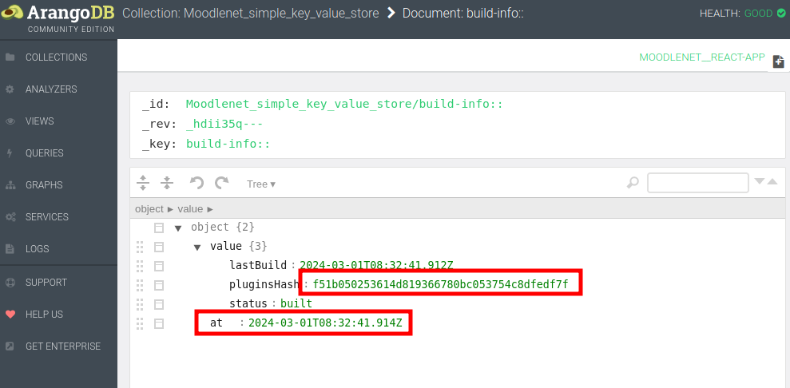

# Deploy a MoodleNet custom environment

## Preface

Note: I am a less experienced developer in the node.js environment. Therefore,
the approach described here, might not the intended way to do it.

The use case for this approach is: I can locally develop my MoodleNet
instance (having a fork from the master repo) and then deploy my changes
onto a public accessible installation.

The drawback is that I use a dev environment on a production machine, e.g.
the optimized code etc. is not used.

## Prerequisites

The setup of the live MoodleNet installation is a mixture as described in
the setup MoodleNet for a [development](docker_setup_dev.md) and the
[production](docker_setup.md) environment. From the production we use all
setup that is not the MoodleNet code. The MoodleNet code needs to be the changeset
that is in our repo and not coming from the public npm repository.

### General Setup

On the server the layout looks like this:
```
lrwxrwxrwx 1 ubuntu ubuntu        33 Jun  5 18:16 moodlenet-dev -> /home/ubuntu/moodlenet-release-47
-rw-rw-r-- 1 ubuntu ubuntu 289485491 Jun  5 18:17 moodlenet-release-45.tar.gz
drwxr-xr-x 9 ubuntu ubuntu      4096 May  1 09:37 moodlenet-release-46
drwxr-xr-x 9 ubuntu ubuntu      4096 Jun  5 18:16 moodlenet-release-47
drwxrwxr-x 7 ubuntu ubuntu      4096 Dec 19 13:31 moodlenet-simple-file-store
-rw-rw-r-- 1 ubuntu ubuntu      9630 Jun  5 18:16 nohup.out.46
-rw-rw-r-- 1 ubuntu ubuntu      9674 Jun  5 18:18 nohup.out.47
-rw-rw-r-- 1 ubuntu ubuntu         3 Jun  5 18:15 release.version
```

The installation itself is in one of the release dirs and `moodlenet-dev` pointing to it. The current release version is in the similar named file.
The previous release is kept in order to switch back in an case of an emergency. The older releases are packed and archived and later also deleted.

The node server needs to be started with `npm run dev-start-backend my-dev` and not
like in production with `npm start`.
Because of the nature, that you don't want the running moodle net process to be attached to a terminal, the service is started by
```
nohup npm run dev-start-backend my-dev > ~/nohup.out.XX 2>&1  &
```
Note that this command needs to be executed inside the installation dir.

All data (uploads of oer material as well as the config) is located in the `moodlenet-simple-file-store`. This directory contains the following directories:
* `collection`
* `config`
* `ed-resource`
* `organization`
* `web-user`

which are all symlinked from their original location e.g.
```
ls -l moodlenet-dev/.dev-machines/my-dev/fs/@moodlenet/ed-resource/
total 4
lrwxrwxrwx 1 ubuntu ubuntu 70 Jun  5 18:16 simple-file-store -> /home/ubuntu/moodlenet-simple-file-store/ed-resource/simple-file-store
```

The only exception is `config` which contains the files that configure the Moodle Net
instance and are copied into `moodlenet-dev/.dev-machines/my-dev/`. The configurations
directory contains the following files:
```
ls -l moodlenet-simple-file-store/config/
total 20
-rw-rw-r-- 1 ubuntu ubuntu 1942 Jun  5 15:25 default.config.json
-rw-r--r-- 1 ubuntu ubuntu 1708 Dec 19 13:32 default.crypto.privateKey
-rw-r--r-- 1 ubuntu ubuntu  451 Dec 19 13:32 default.crypto.publicKey
-rw-r--r-- 1 ubuntu ubuntu 1740 Jun  5 15:27 saml.cert
-rw------- 1 ubuntu ubuntu 2484 Jun  5 15:27 saml.pem
```

The two saml files are for our SSO and are missing in the default MoodleNet installation.

### Start/Stop script

Because of some configuration changes and troubleshooting I needed an easy start/stop service.
This let me write the `service.sh` script which starts or stops the MoodleNet service
according to the setup described above.
Since MoodleNet is the only node software running on the machine, the `killall node` can be
used to stop the service. If you have more node services running, this would kill them as well.

#### systemd

For some reason with the systemd script the MoodleNet service couldn't be reliably restarted (in
conjunction with the dev environment - it works in the production environment).
Therefore, the `service.sh`script can be used to start and stop MoodleNet. Maybe with this script
handling can be delegated again to systemd, this needs to be checked out.


### Deploy process

The whole effort to deploy a MoodleNet dev installation onto a public server is in the script `deploy-dev.sh`. The script relies on the setup as described above.

The deploy-script does the following:
* Create a new release number (this is a natural number that's increased by one during every deployment and stored in `release.version`).
* Copy everything into a new release directory based on that release number. Several files can be omitted
  (with the `--exclude` flag).
* On the server link the uploaded dir with the new release dir.
* Restart the MoodleNet service (try to kill any npm processes, restart MoodleNet with the provided command)
  and check if the site is reachable.
* Delete and/or tar older release directories (this may take a while).

At the moment the deploy-script does several curl calls to check whether the
service is up and running again.

Note: When the server is restarted, the webapp needs to be compiled again. Even though
the server returns HTTP code 200, the output actually is "temporarily unavailable".
In the console output (in this setup simply do a `tail -f ~/nohup.out.XX`) you can
observe any progress and possible errors if something doesn't work.

Adjustments to the script need to be done for all vaiables that are in capital letters. This can be done by using a config file that is passed to the deploy script.
The file `dev.config.skeleton` contains all possible settings that are possible at the moment. If some of these assumtions do not meet your infrastructure and cannot
be set by the config parameters, then please make the required adjustments in the
deploy script itself, or report it here to make the script more flexible.

Todo:
* have an restore script that reverts back to a certain release.

### Troubleshooting

Although mostly automated, the deployment process does not aways run smoothly from start to end.

#### Server does not come up

After the deployment, the npm process is killed and the service is started again. This takes a while
and the deploy script checks several times for a 200 response. If that does not work, the npm service probably hungs because of some error.

```
Try to reach https://oer.example.org ... failed with response 502
Retry ... failed with response 502
Retry ... failed with response 502
Retry ... failed with response 504
Retry ... failed with response 504
Retry ... failed with response 504
Retry ... failed with response 504
Retry ... 

```

Login with another shell, in the log of the current process started with `nohup` the error can be
spotted:

```
tail nohup.out.32 

...
[Error: ENOENT: no such file or directory, open '/home/ubuntu/moodlenet-dev/.dev-machines/my-dev/fs/@moodlenet/react-app/webapp-build/latest-build/index.html'] {
  errno: -2,
  code: 'ENOENT',
  syscall: 'open',
  path: '/home/ubuntu/moodlenet-dev/.dev-machines/my-dev/fs/@moodlenet/react-app/webapp-build/latest-build/index.html'
}

```

Then just copy manually the freashly build webapp code at the correct place:
```
 cp -r moodlenet-release-32/react-app_latest-build/* moodlenet-dev/.dev-machines/my-dev/fs/@moodlenet/react-app/webapp-build/latest-build/.
```

When you call now the url once more, the page should show up immediately because the built is there.

Note: since MoodleNet 4.1 with Node 20 the webapp builds without any problem, the troubleshooting was not necessary anymore.

#### Missing changes in the webapp

When you develop locally and use the watch process from the webapp, the webapp is build immediately.

Basically, before deploying the latest changes from the webapp make sure that these changes are visible
when you call http://localhost:8080. This is the backend service containing the latest webapp.
When the changes are not visible, the webapp has to be rebuilt.

1. Check that in the `default.config.json` the build of the webapp is enabled. The keys `pkgs.@moodlenet/react-app.noWebappBuilder` and
`pkgs.@moodlenet/react-app.noWebappServer` should be set to *false*.
1. Manipulate the last build entry in the database and set the hash
key and last built date to something else. The Arango DB can be reached
via the browser at http://localhost:8529/_db/moodlenet__react-app/_admin/aardvark/index.html#collection/Moodlenet_simple_key_value_store/build-info%3A%3A and looks like this: 
Change the red framed values and hit save at the bottom (not in screenshot).
Then call once again http://localhost:8080
On the console of the process you should see now output of the build
process and the page takes some time until it is displayed.
